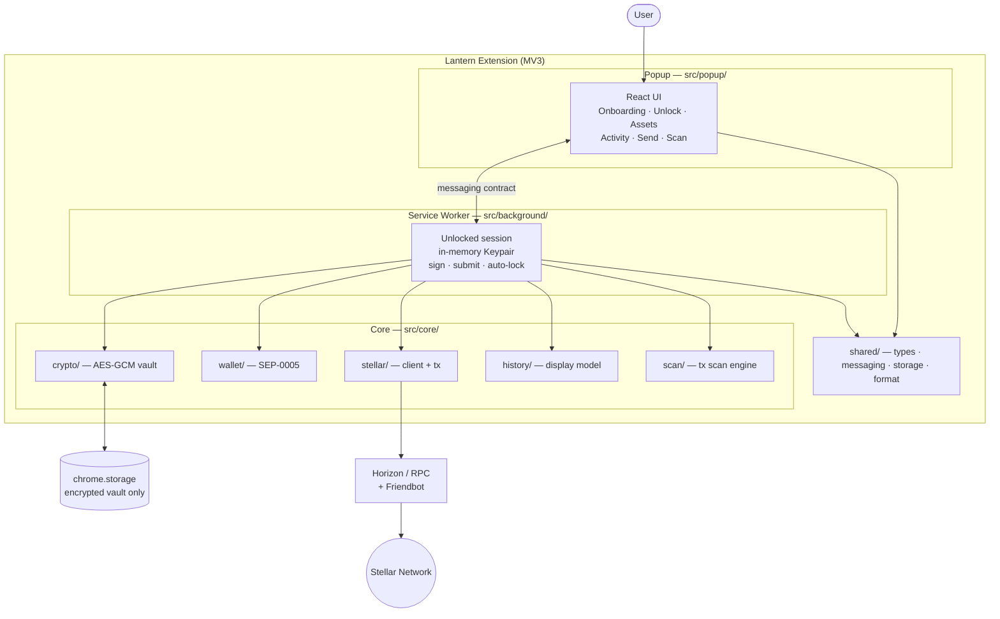
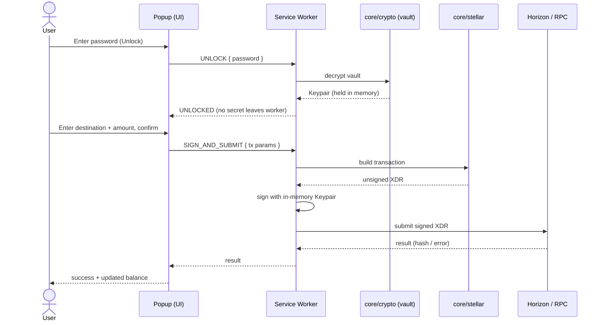
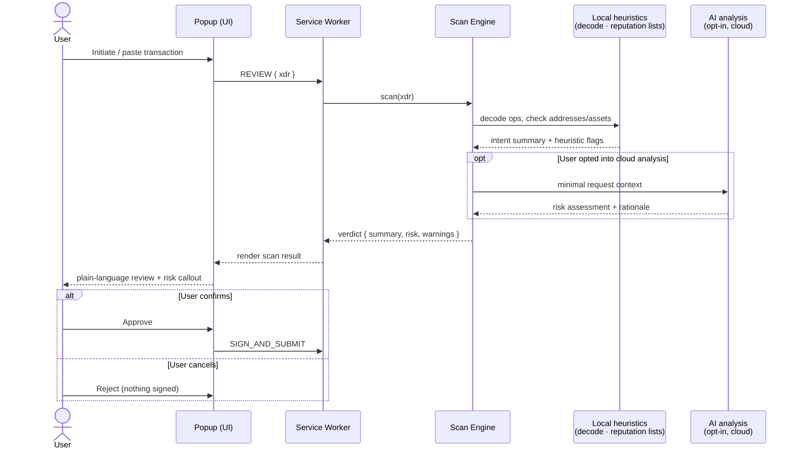
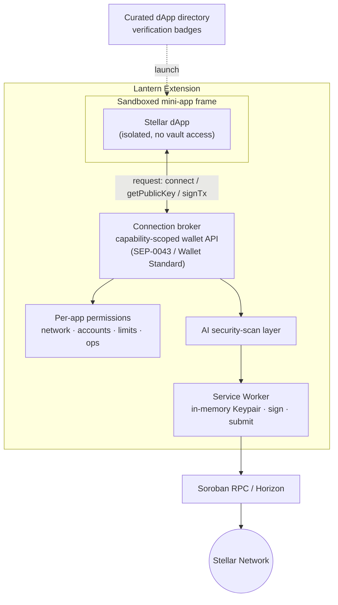
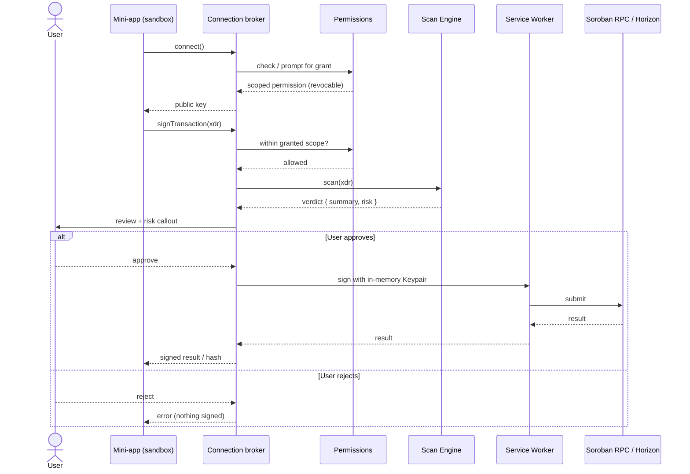

# Lantern — Stellar Wallet (Chrome Extension)

A non-custodial browser-extension wallet for the [Stellar](https://stellar.org) network.
Create or import a wallet, view balances, send assets, and review history — keys never
leave the device and are encrypted at rest behind a password.

## Stack

TypeScript (strict) · React 18 · Tailwind CSS · Vite + `@crxjs/vite-plugin` (MV3) ·
`@stellar/stellar-sdk` · `bip39` + `stellar-hd-wallet` (SEP-0005) · Web Crypto (AES-GCM / PBKDF2).

## Commands

```bash
npm install        # install deps
npm run dev        # Vite dev build, watch mode (loadable unpacked from dist/)
npm run build      # typecheck + production build → dist/
npm run typecheck  # tsc --noEmit
npm run lint       # eslint
npm run test       # vitest run
npm run icons      # regenerate extension icons
```

## Load in Chrome

1. `npm run build`
2. Open `chrome://extensions` → enable **Developer mode**
3. **Load unpacked** → select the `dist/` folder
4. Pin **Lantern** and open the popup.

## Architecture

- **`src/popup/`** — React UI (Onboarding, Unlock, Assets, Activity, Send). Never holds
  the decrypted secret in state.
- **`src/background/`** — MV3 service worker. Owns the unlocked session: decrypts on unlock,
  keeps the `Keypair` in memory, signs/submits transactions, auto-locks. Treated as ephemeral
  (re-unlock required if the worker is torn down).
- **`src/core/`** — framework-agnostic, unit-tested logic: `crypto/` (vault), `wallet/`
  (SEP-0005 derivation), `stellar/` (network-aware Horizon client + tx builders), `history/`
  (operation → display model).
- **`src/shared/`** — types, the popup↔worker messaging contract, storage wrapper, constants,
  formatting.

### Component diagram



### Sequence — unlock & send a payment



## Security notes

- Only the **encrypted** vault (AES-GCM, PBKDF2 ≥ 600k iterations) is persisted; the decrypted
  secret lives solely in worker memory while unlocked.
- No secret material is ever logged, persisted in plaintext, or sent to the popup beyond the
  transient onboarding display of a freshly generated phrase.
- Minimal permissions: `storage` plus host access limited to the Horizon + Friendbot endpoints.
- Testnet vs Mainnet is always visually distinct (BRAND §8).

## Networks

Toggle Testnet/Mainnet from the top app bar. On Testnet, unfunded accounts can be funded via
Friendbot; on Mainnet they show a base-reserve explainer.

## Roadmap

Lantern today is a focused, non-custodial wallet. The next phases extend it from "hold and
send" into a safer, programmable surface for the Stellar ecosystem.

### AI-powered security scans

Before a user signs anything, Lantern will run the request through an AI-assisted review layer
that explains *what the user is actually about to authorize* in plain language and flags risk.

- **Transaction intent analysis** — decode the operations in a transaction (payments, trustline
  changes, offers, account merges, `setOptions`) and summarize them in human terms, highlighting
  irreversible or high-impact actions (e.g. removing a signer, raising/lowering thresholds,
  draining XLM below reserve).
- **Soroban contract scanning** — for contract invocations, inspect the called contract,
  arguments, and authorization entries; warn on unlimited token allowances, unexpected
  authorizers, or interactions with contracts not seen before.
- **Address & asset reputation** — cross-check destinations and assets against allow/deny lists
  and heuristics (known scam addresses, look-alike/homoglyph asset codes, unverified issuers)
  and surface a clear trust signal.
- **Phishing & dApp-origin checks** — validate the requesting site's origin against the
  transaction it asks for, catching mismatches and spoofed connection prompts.
- **Privacy-preserving by design** — scans run with the minimum data needed and never expose
  secret key material; on-device heuristics handle the common cases, with optional cloud-assisted
  analysis the user can opt into.

The goal is a "second pair of eyes" at signing time that turns opaque XDR into an informed
decision, without taking custody or blocking the user from proceeding.

#### Sequence — scan before signing



### Mini-app browser for Stellar dApps

Lantern will host an in-wallet **mini-app browser** so Stellar dApps can run inside a trusted,
permissioned container instead of arbitrary web tabs — the wallet, identity, and signing context
travel with the user.

- **Sandboxed runtime** — mini-apps load in an isolated frame with no direct access to the vault
  or service worker; all chain interactions go through a brokered, capability-scoped API.
- **Standard connection layer** — a wallet API (aligned with Stellar interop standards such as
  SEP-0043 / Wallet Standard and Soroban RPC) for connecting, requesting the public key,
  building, and signing transactions — so existing dApps integrate with minimal changes.
- **Per-app permissions** — users grant scoped, revocable permissions per mini-app (which
  network, which accounts, spending/allowance limits, which operations), reviewable from a single
  place.
- **Every action runs through the security-scan layer** — mini-app transaction requests are
  reviewed by the AI scans above before any signing prompt, so a compromised or malicious app
  still can't slip an opaque transaction past the user.
- **Discovery & curation** — a vetted directory of Stellar dApps (DeFi, payments, NFTs, anchors)
  with metadata, verification badges, and clear network/permission expectations before launch.
- **Seamless UX** — connect once, switch accounts and networks without re-pasting addresses, and
  keep history and balances in sync across the wallet and the apps the user runs.

#### Architecture — mini-app container



#### Sequence — mini-app requests a signature



Together these make Lantern a place to *use* Stellar safely, not just store it — programmable
surface for dApps, with an AI safety net between the user and every signature.
