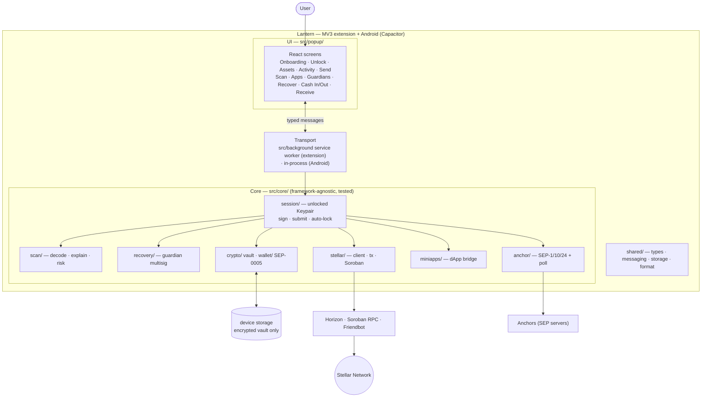
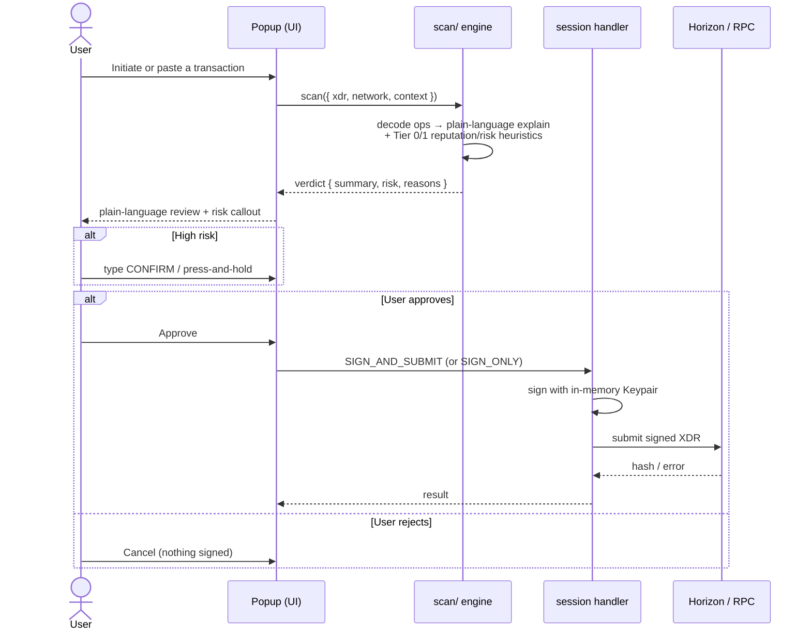
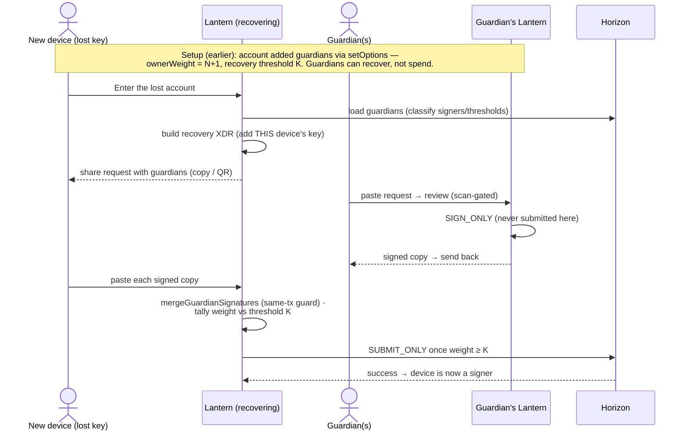
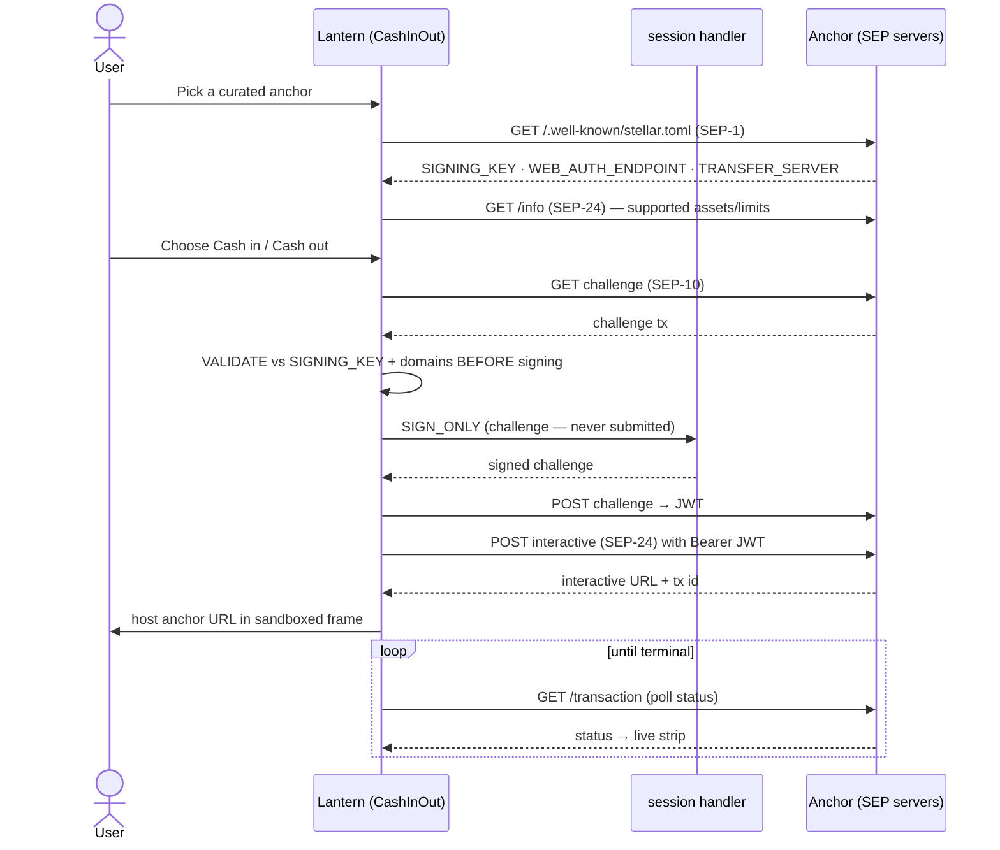

# Lantern — the security-first Stellar wallet

Lantern is a **non-custodial wallet for [Stellar](https://stellar.org)** that ships as a Chrome/MV3 **browser extension** and an **Android app** (Capacitor), from one TypeScript/React codebase. Beyond the basics — create or import an account (SEP-0005 HD keys), hold and send XLM/assets, and review history — Lantern does three things ordinary wallets don't: it **reads every transaction back to you in plain English and gates the dangerous ones before you sign**; it **removes the "lose your 12 words, lose everything" failure mode** with *guardian social recovery* built on Stellar's native weighted multisig; and it **turns cash into crypto in-app** through regulated *anchors* (SEP-1/10/24). Stellar dApps and DeFi (e.g. Blend) run inside a sandboxed **mini-app browser**, and — crucially — **every signature, from a payment to a recovery to a contract call, is routed through the same `scan → explain → confirm → sign` pipeline**. Keys never leave the device and are encrypted at rest.

Self-custody has two silent killers: users approve transactions they can't read (one malicious `setOptions` can hand an attacker a signer and drain the account), and a lost seed phrase means funds are gone forever. Those failure modes push mainstream users off self-custody — while Stellar's real differentiators (regulated fiat **anchors**, protocol-native **weighted multisig**, fast/near-free **USDC payments**, and **Soroban** smart contracts) sit underused behind opaque UX. Lantern's impact on the Stellar ecosystem is to wrap those native primitives in a safe, human interface: it drives real **SEP-24 anchor volume** by making cash-in/out a first-class in-wallet flow, it **showcases multisig-based recovery** and **legible Soroban interactions** as patterns other builders can copy, and its security layer is designed as a **public good** (an auditable, on-chain-anchored risk registry other Stellar wallets can reuse). The goal: make Stellar's superpowers safe enough for everyday users, and raise the whole ecosystem's security bar in the process.

---

## What's in the box (shipped today)

| Area | What it does |
|---|---|
| **Wallet core** | Create/import (SEP-0005 HD derivation), AES-GCM vault (PBKDF2 ≥ 600k), balances, send, activity/history, Receive QR, Testnet/Mainnet toggle with Friendbot funding. |
| **Security scan** | Decodes a transaction's operations, explains them in plain language (payments, trustlines, `setOptions` signer/threshold changes, Soroban/DeFi calls), assigns a risk verdict, and gates high-risk actions behind a **type-CONFIRM / press-&-hold** prompt. Tier 0/1 on-device today (opt-in Tier 2 cloud + reputation registry are roadmapped). |
| **Guardian recovery** | *Kill the seed phrase.* Add guardians (native multisig `setOptions`), co-sign someone's recovery on your own device (`SIGN_ONLY`, out-of-band), and recover a lost account onto a new device once enough guardians sign. Anti-drain invariant enforced (guardians can recover but not spend). |
| **Anchors — Cash in / Cash out** | SEP-1 `stellar.toml` discovery → SEP-24 `/info` asset discovery → **validated** SEP-10 web-auth (challenge checked against the anchor's `SIGNING_KEY` *before* signing) → interactive deposit/withdraw in a sandboxed frame → live status polling. Curated anchor directory. |
| **DeFi / mini-apps** | A sandboxed **mini-app browser** with a read-only connect bridge + a scan-gated payment/sign bridge; a typed **Soroban invoke-contract** builder + RPC **`simulateTransaction`**; plain-language labels for DeFi calls (e.g. Blend `supply`/`withdraw`). |
| **Platforms** | Chrome MV3 extension **and** Android (Capacitor): safe-area-aware layout, debug-APK CI. |

> Status: the merged codebase is unit-tested (200+ tests) with green extension + Android builds. In-flight and roadmapped items (full anchor screen wiring, reputation backend, biometric/passkey unlock, in-wallet swaps) are tracked as GitHub issues — see **Roadmap**.

## Stack

TypeScript (strict) · React 18 · Tailwind CSS · Vite + `@crxjs/vite-plugin` (MV3) · Capacitor (Android) ·
`@stellar/stellar-sdk` 16 · `bip39` + SEP-0005 HD derivation · Web Crypto (AES-GCM / PBKDF2) · Vitest.

## Commands

```bash
npm install         # install deps
npm run dev         # Vite dev build, watch mode (load unpacked from dist/)
npm run build       # typecheck + production build → dist/
npm run typecheck   # tsc --noEmit
npm run lint        # eslint
npm run test        # vitest run
npm run build:mobile && npm run cap:sync   # build web assets and sync into the Android project
npm run icons       # regenerate extension icons  (icons:android for Android)
npm run verify:flags # prove disabled features are stripped from the release bundle
```

**Load the extension:** `npm run build` → `chrome://extensions` → enable **Developer mode** → **Load unpacked** → select `dist/` → pin **Lantern**.
**Android:** `npm run build:mobile && npm run cap:sync`, then open `android/` in Android Studio (or use the `build-debug-apk` CI job).

---

## Build-time feature flags

Optional / external / in-progress surfaces are gated at **build time** so a lean,
auditable store build ships only what's enabled — a disabled feature's code (and
its imports) **dead-code-eliminate** out of the bundle rather than shipping
always-on. Flags are booleans, resolved from `VITE_FEATURE_*` env at build time;
the single source of truth is [`src/shared/flag-defs.ts`](src/shared/flag-defs.ts)
and every flag is documented in [`.env.example`](.env.example).

| Flag (`VITE_FEATURE_…`) | Gates | Default |
|---|---|---|
| `SWAP` | Swap screen + SDEX/path-payment engine | **ON** |
| `SWAP_AGGREGATOR` | Soroswap aggregator (not built) | **OFF** |
| `EARN_BLEND` | Earn / Blend supply-withdraw | **ON** |
| `ANCHORS` | Cash in / Cash out (SEP-24) | **ON** |
| `BIOMETRIC_UNLOCK` | Biometric unlock (#23 M2a) — active on Android, inert on web/extension | **ON** |
| `GEOVELOCITY` | Impossible-travel risk signal (needs a Cloudflare Worker) | **OFF** |
| `MINIAPPS` | dApp mini-apps browser | **ON** |
| `DEMO_AFFORDANCES` | `forceScenario` + the demo deny-list (demo only) | **OFF** |
| `PASSKEY` | Passkey smart accounts — seed-phrase-free Soroban account (#53, testnet) | **OFF** |

Read a flag's **behavior** via `FLAGS.<name>` (`src/shared/flags.ts`); for code
that must **tree-shake** (strip an import), guard it with the matching
`__FEATURE_<NAME>__` build literal (`src/feature-flags.d.ts`, injected by
`vite.flags.ts`). To flip one, set the env var for the build, e.g.:

```bash
VITE_FEATURE_DEMO_AFFORDANCES=true npm run build   # canary build with demo bits
VITE_FEATURE_SWAP=false npm run build              # store build without swaps
```

Both build targets (`build` → `dist/`, `build:mobile` → `dist-mobile/`) honor the
same flags via a shared helper, and `npm run verify:flags` asserts an off flag's
code is actually absent from the emitted bundle.

## Testnet smart contracts

All Soroban work runs on the **Stellar Testnet** (`Test SDF Network ; September 2015`,
RPC `https://soroban-testnet.stellar.org`). Testnet is periodically reset, which
wipes deployed state — re-deploy and update the pinned ids when that happens.
Explore any id at `https://stellar.expert/explorer/testnet/contract/<id>`.

### Deployed by Lantern

| Contract | Address / hash | Purpose |
| --- | --- | --- |
| **Lantern Earn** (Blend v2 pool) | `CC4KSBTTPCKZUYBXB47SSZGXTKO6G23Y6LJOIR6YCOJVTGJZEYJCHBOH` | Our own lending pool, deployed via the Blend factory with curated USDC + XLM reserves (#109). Wired in `src/core/blend/directory.ts`; re-deploy with `scripts/deploy-lantern-pool.sh`. |
| **Passkey smart account** (WASM) | wasm hash `8759fa9e49446cb8d332da8fee973c453b1178fb0525345892991f4997d8451b` | secp256r1 / WebAuthn custom-account contract (#53). The WASM is installed on testnet and vendored in `src/core/passkey/contractWasm.ts`; a fresh **instance** is deployed per passkey account during seed-phrase-free onboarding. |

### Reserve / asset tokens (Stellar Asset Contracts)

| Asset | SAC address | Used by |
| --- | --- | --- |
| **USDC** | `CAQCFVLOBK5GIULPNZRGATJJMIZL5BSP7X5YJVMGCPTUEPFM4AVSRCJU` | Earn (supply/withdraw), swaps |
| **XLM** (native) | `CDLZFC3SYJYDZT7K67VZ75HPJVIEUVNIXF47ZG2FB2RMQQVU2HHGCYSC` | Earn (supply/withdraw), swaps |

### Blend v2 infrastructure we build on

Third-party contracts from [blend-utils](https://github.com/blend-capital/blend-utils)
(`testnet.contracts.json`) — not ours, but our pool + Earn stack depend on them.

| Contract | Address | Role |
| --- | --- | --- |
| **poolFactoryV2** | `CDV6RX4CGPCOKGTBFS52V3LMWQGZN3LCQTXF5RVPOOCG4XVMHXQ4NTF6` | Deploys the Lantern Earn pool instance |
| **oraclemock** | `CAZOKR2Y5E2OSWSIBRVZMJ47RUTQPIGVWSAQ2UISGAVC46XKPGDG5PKI` | Prices the USDC / XLM reserves |
| **backstopV2** | `CBDVWXT433PRVTUNM56C3JREF3HIZHRBA64NB2C3B2UNCKIS65ZYCLZA` | Blend backstop module |
| **Blend V2 Testnet Pool** | `CCEBVDYM32YNYCVNRXQKDFFPISJJCV557CDZEIRBEE4NCV4KHPQ44HGF` | Third-party pool also listed in the Earn directory (proves no ABI regression) |
| **BLND token** | `CB22KRA3YZVCNCQI64JQ5WE7UY2VAV7WFLK6A2JN3HEX56T2EDAFO7QF` | Blend emissions token |

## Architecture

Lantern is split into a thin platform shell, a UI layer that **never holds the decrypted secret**, and a framework-agnostic, unit-tested core.

- **`src/popup/`** — React UI (screens: Onboarding, Unlock, Assets, Activity, Send, Scan, Apps, Guardians, CoSignRecovery, RecoverAccount, CashInOut, Receive, TxDetail). Talks to the session only through a typed message contract.
- **`src/background/`** — MV3 service worker: a **thin transport** that routes `chrome.runtime` messages into the shared session handler. On Android (single process) the same handler runs in-process.
- **`src/core/`** — all logic, no framework:
  - `crypto/` — AES-GCM vault · `wallet/` — SEP-0005 derivation
  - `session/` — the unlocked session (in-memory `Keypair`, sign/submit, auto-lock)
  - `stellar/` — network-aware Horizon client, tx builders, Soroban `invoke`/`simulate`
  - `scan/` — decode · explain · reputation/risk engine
  - `recovery/` — guardian multisig setup / update / recovery / co-signature merge
  - `anchor/` — SEP-1 toml · SEP-10 auth · SEP-24 interactive + status poll · curated directory
  - `miniapps/` — dApp bridge + curated directory · `history/` — op → display model · `receive/` — QR payload
- **`src/shared/`** — types, the popup↔session **messaging contract**, storage wrapper, constants, formatting.

### Component diagram


```mermaid
flowchart TB
    user([User])

    subgraph ext["Lantern — MV3 extension + Android (Capacitor)"]
        subgraph ui["UI — src/popup/"]
            screens["React screens<br/>Onboarding · Unlock · Assets · Activity · Send<br/>Scan · Apps · Guardians · Recover · Cash In/Out · Receive"]
        end
        transport["Transport<br/>src/background service worker (extension)<br/>· in-process (Android)"]
        subgraph core["Core — src/core/ (framework-agnostic, tested)"]
            session["session/ — unlocked Keypair<br/>sign · submit · auto-lock"]
            scan["scan/ — decode · explain · risk"]
            recovery["recovery/ — guardian multisig"]
            anchor["anchor/ — SEP-1/10/24 + poll"]
            stellar["stellar/ — client · tx · Soroban"]
            miniapps["miniapps/ — dApp bridge"]
            crypto["crypto/ vault · wallet/ SEP-0005"]
        end
        shared["shared/ — types · messaging · storage · format"]
    end

    storage[("device storage<br/>encrypted vault only")]
    horizon["Horizon · Soroban RPC · Friendbot"]
    anchors["Anchors (SEP servers)"]
    network(("Stellar Network"))

    user --> screens
    screens <-->|"typed messages"| transport
    transport --> session
    session --> scan
    session --> recovery
    session --> anchor
    session --> stellar
    session --> miniapps
    session --> crypto
    crypto <--> storage
    stellar --> horizon
    anchor --> anchors
    horizon --> network
```

### Sequence — scan before signing (every signature passes here)


```mermaid
sequenceDiagram
    actor U as User
    participant P as Popup (UI)
    participant SC as scan/ engine
    participant W as session handler
    participant H as Horizon / RPC

    U->>P: Initiate or paste a transaction
    P->>SC: scan({ xdr, network, context })
    SC->>SC: decode ops → plain-language explain<br/>+ Tier 0/1 reputation/risk heuristics
    SC-->>P: verdict { summary, risk, reasons }
    P-->>U: plain-language review + risk callout
    alt High risk
        U->>P: type CONFIRM / press-and-hold
    end
    alt User approves
        U->>P: Approve
        P->>W: SIGN_AND_SUBMIT (or SIGN_ONLY)
        W->>W: sign with in-memory Keypair
        W->>H: submit signed XDR
        H-->>W: hash / error
        W-->>P: result
    else User rejects
        U->>P: Cancel (nothing signed)
    end
```

### Sequence — guardian social recovery (no seed phrase)


```mermaid
sequenceDiagram
    actor N as New device (lost key)
    participant L as Lantern (recovering)
    actor G as Guardian(s)
    participant GL as Guardian's Lantern
    participant H as Horizon

    Note over N,GL: Setup (earlier): account added guardians via setOptions —<br/>ownerWeight = N+1, recovery threshold K. Guardians can recover, not spend.

    N->>L: Enter the lost account
    L->>H: load guardians (classify signers/thresholds)
    L->>L: build recovery XDR (add THIS device's key)
    L-->>N: share request with guardians (copy / QR)
    G->>GL: paste request → review (scan-gated)
    GL->>GL: SIGN_ONLY (never submitted here)
    GL-->>G: signed copy → send back
    N->>L: paste each signed copy
    L->>L: mergeGuardianSignatures (same-tx guard) ·<br/>tally weight vs threshold K
    L->>H: SUBMIT_ONLY once weight ≥ K
    H-->>L: success → device is now a signer
```

### Sequence — anchor Cash in / Cash out (SEP-1 → SEP-10 → SEP-24)


```mermaid
sequenceDiagram
    actor U as User
    participant L as Lantern (CashInOut)
    participant W as session handler
    participant A as Anchor (SEP servers)

    U->>L: Pick a curated anchor
    L->>A: GET /.well-known/stellar.toml (SEP-1)
    A-->>L: SIGNING_KEY · WEB_AUTH_ENDPOINT · TRANSFER_SERVER
    L->>A: GET /info (SEP-24) — supported assets/limits
    U->>L: Choose Cash in / Cash out
    L->>A: GET challenge (SEP-10)
    A-->>L: challenge tx
    L->>L: VALIDATE vs SIGNING_KEY + domains BEFORE signing
    L->>W: SIGN_ONLY (challenge — never submitted)
    W-->>L: signed challenge
    L->>A: POST challenge → JWT
    L->>A: POST interactive (SEP-24) with Bearer JWT
    A-->>L: interactive URL + tx id
    L->>U: host anchor URL in sandboxed frame
    loop until terminal
        L->>A: GET /transaction (poll status)
        A-->>L: status → live strip
    end
```

## Security model

- Only the **encrypted** vault (AES-GCM, PBKDF2 ≥ 600k) is persisted; the decrypted secret lives solely in session memory while unlocked, and the session auto-locks.
- **No secret material** is ever logged, persisted in plaintext, or sent to the UI beyond the transient onboarding display of a freshly generated phrase. Public keys (`G…`) only in logs.
- **Sign-only, never submit** paths (`SIGN_ONLY`) let guardians co-sign and let SEP-10 challenges be signed **without** broadcasting — a malicious anchor/app can't get a submitted transaction out of a signing prompt.
- **Validate-before-sign** for anchors: the SEP-10 challenge is checked against the anchor's discovered `SIGNING_KEY` and expected domains before the signer is ever called.
- Minimal permissions; Testnet vs Mainnet is always visually distinct.

## Roadmap

Lantern's shipped scope is a coherent, tested product; these extend it further and are tracked as GitHub issues:

- **Finish the anchor flow** — screen wiring for interactive Cash in/out + live Testnet demo (in review).
- **Reputation backend (public good)** — replace the demo deny-list with a real reputation API + on-chain-anchored, auditable risk registry any wallet can verify (Tier 2).
- **Kill the seed phrase, level 2** — biometric/WebAuthn unlock, then **passkey smart accounts** (secp256r1 Soroban smart wallets) for truly seed-phrase-free accounts.
- **Use Stellar, don't just hold it** — in-wallet swaps (SDEX/AMM + Soroban DEX), path payments, SEP-7 request-to-pay, and richer DeFi (Blend supply/withdraw UI).
- **Platform hardening** — lifecycle auto-lock, release signing, Android QR-scan, iOS.

See `docs/features.md` for the full shipped-changes log and `AGENT.md` for the contributor/agent guide.
