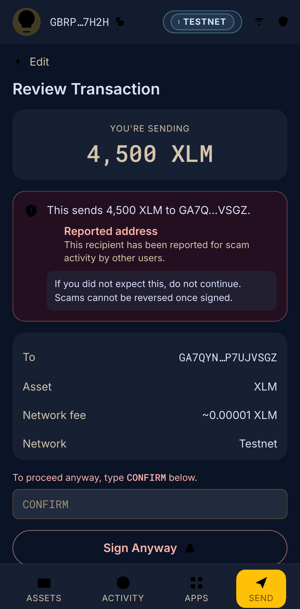
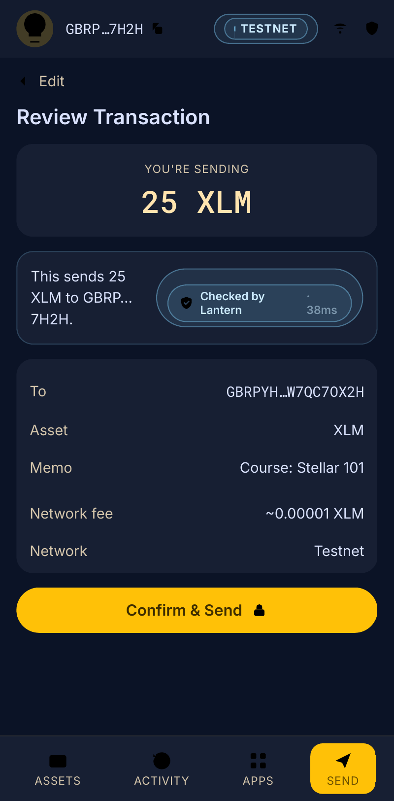
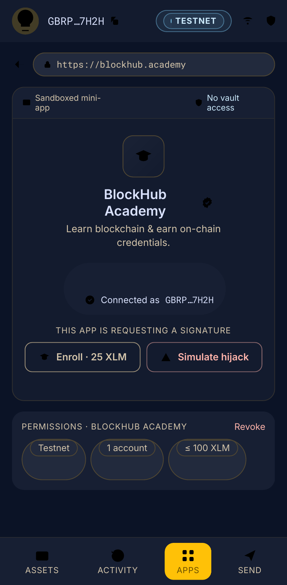
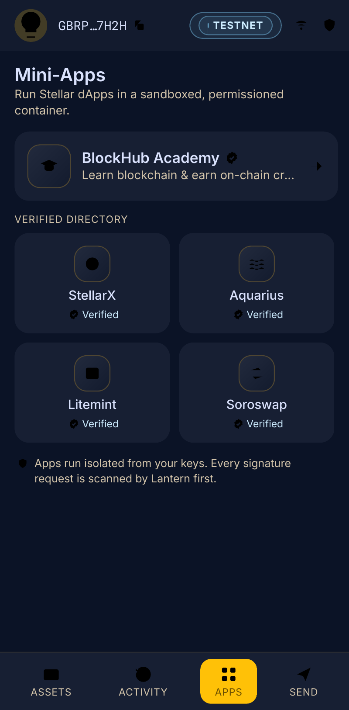

# Lantern — demo screenshots

Showcase images for the demo features in issue #2. Rendered from the app's real
screen markup and brand tokens (`tailwind.config.ts` / `BRAND.md`), framed in the
extension popup.

| Scenario | Image |
|---|---|
| **AI scan — unsafe transaction** (sending to a reported address triggers a high-risk block + type-`CONFIRM` gate) |  |
| **AI scan — safe transaction** ("Checked by Lantern" pass, normal sign) |  |
| **blockhub.academy in the mini-app browser** (sandboxed frame, brokered connect, scanned signature requests) |  |
| **Mini-apps store** (curated directory with verified badges) |  |
