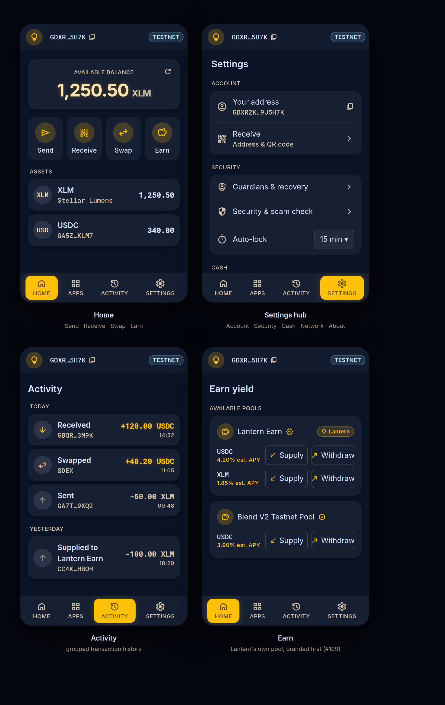
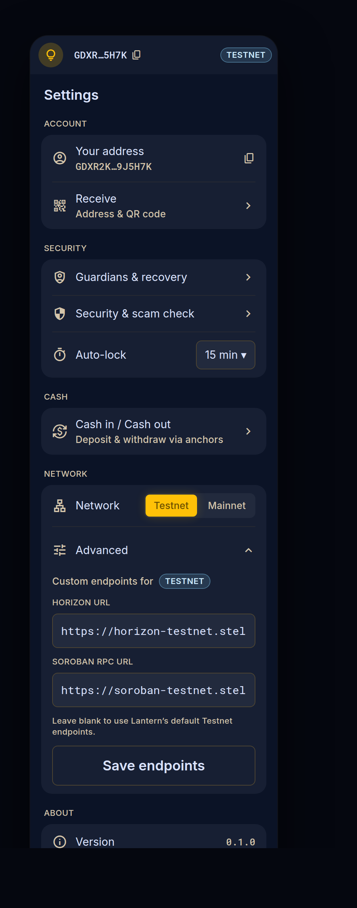

# UI screenshots

Reference screenshots of the Lantern wallet popup after the Phantom-style UX
overhaul (#110) and the Lantern-owned Earn pool (#109).

These are **faithful design renders**: the app can't boot in a plain browser
(it needs the extension / Capacitor runtime and an unlocked wallet to reach
these screens), so each image is the real component markup rendered against the
app's actual compiled Tailwind CSS + design tokens and fonts (Inter + Material
Symbols), captured with headless Chrome at the true 360×600 popup size. Data
shown (balances, addresses, APYs) is representative placeholder content.

## Primary surfaces

- **Home** — action-forward: balance hero + a Send · Receive · Swap · Earn
  quick-action row, then the asset list.
- **Settings hub** — everything advanced, grouped: Account · Security · Cash ·
  Network · About.
- **Activity** — grouped transaction history (a bottom-nav tab).
- **Earn** — Lantern's own `Lantern Earn` pool (#109), branded with the amber
  pill and sorted first, above the third-party Blend pool.

Bottom nav is the finalized **Home · Apps · Activity · Settings**.

## Settings → Advanced (endpoint overrides)

The full Settings screen with the **Advanced** disclosure open, showing the new
per-network Horizon / Soroban-RPC endpoint overrides (blank = Lantern's pinned
defaults).
